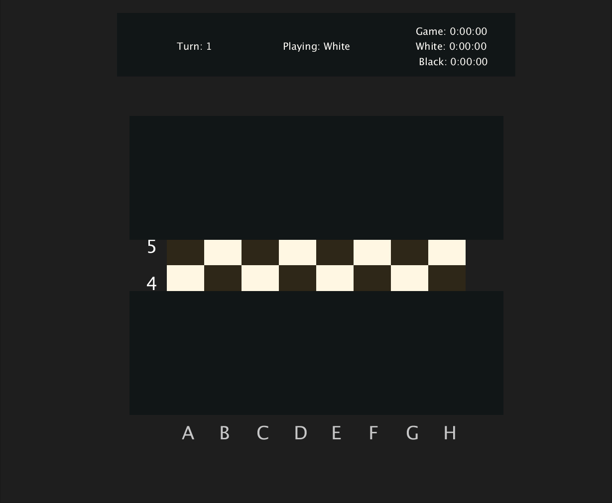
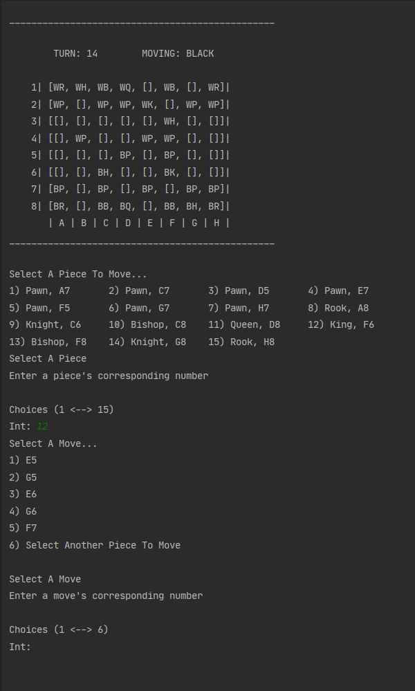

# eight²

This is a Chess project I built from scratch. I used this as an opportunity to learn more about chess and treated each piece as an algorithmic challange and a way to become more familiar with OOP concepts.

This started with a Command-Line application where piece where selected and moved using number inputs from the terminal. Then using processing I was able to use almost all the same code just by adding a GUI and integrating the pre-existing logic. I made many updates after switching to a GUI so the CLI version is not as fleshed out as the GUI version. I would like to take the code from the GUI version and implement it into the CLI so things like check and checkmate are a part of the CLI.

# [GUI](https://github.com/GabrielQZ/eight-squared/tree/master/GUI-version)

# [CLI](https://github.com/GabrielQZ/eight-squared/tree/master/CLI-version) 

